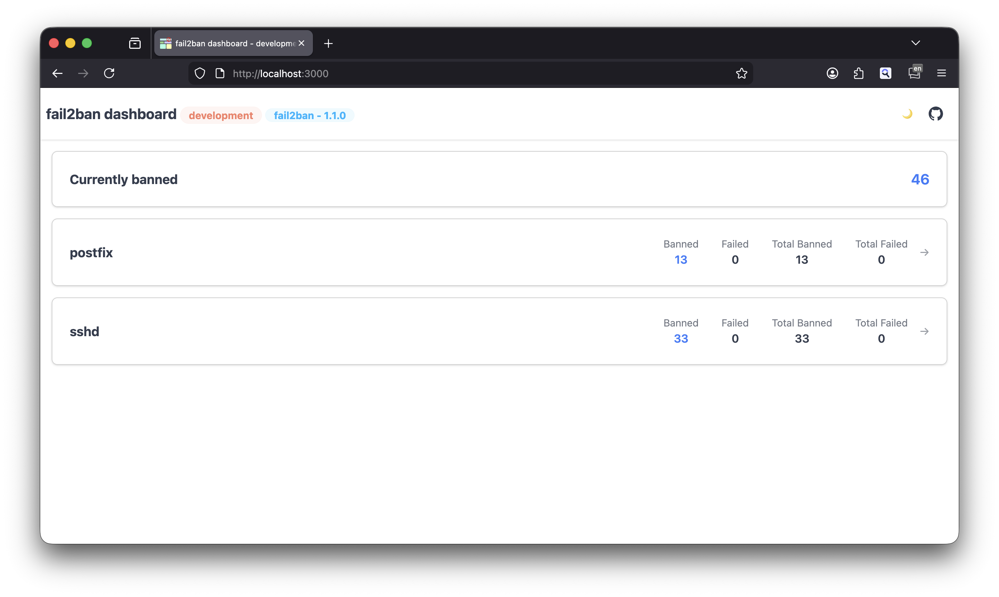
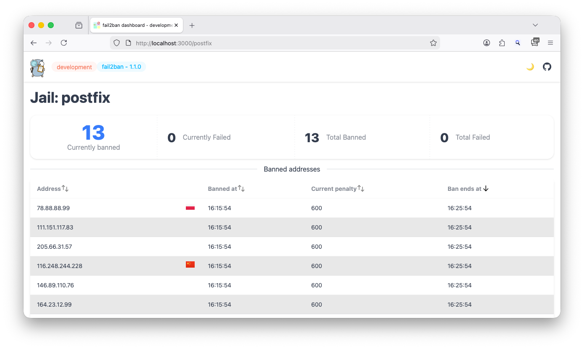
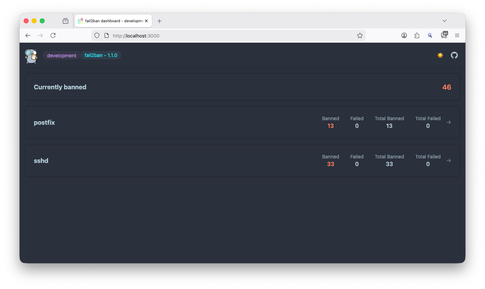
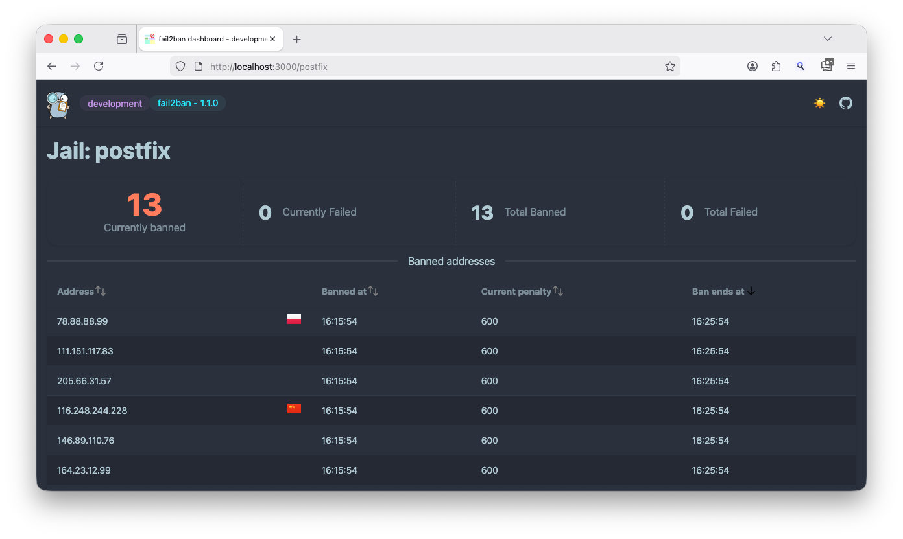

<p align="center">
    <picture>
      <source media="(prefers-color-scheme: dark)" srcset="docs/content/assets/fail2ban-dashboard-mascot_250.png">
      <source media="(prefers-color-scheme: light)" srcset="docs/content/assets/fail2ban-dashboard-mascot_250.png">
      
    </picture>
</p>

# fail2ban-dashboard


A web-based dashboard for `fail2ban` which uses the `/var/run/fail2ban/fail2ban.sock` socket to access `fail2ban`.

Tested with the following `fail2ban` versions
- `0.11.1`
- `0.11.2`
- `1.0.1`
- `1.0.2`
- `1.1.0`

If the dashboard should be used with another version, please switch off the version check with the `--skip-version-check` flag.


## Screenshots

### Light mode



### Dark mode




## Usage

### Command line

```
Usage:
  fail2ban-dashboard [flags]
  fail2ban-dashboard [command]

Available Commands:
  completion  Generate the autocompletion script for the specified shell
  help        Help about any command
  version     Print the version number and git hash

Flags:
  -a, --address string             address to serve the dashboard on, also F2BD_ADDRESS (default "127.0.0.1:3000")
      --auth-password string       password for basic auth, also F2BD_AUTH_PASSWORD
      --auth-user string           username for basic auth, also F2BD_AUTH_USER
      --base-path string           base path of the application, also F2BD_BASE_PATH (default "/")
  -c, --cache-dir string           directory to cache GeoIP data, also F2BD_CACHE_DIR (default current working directory)
  -h, --help                       help for fail2ban-dashboard
      --log-level string           log level (trace, debug, info, warn, error), also F2BD_LOG_LEVEL (default "info")
  -m, --metrics                    will provide metrics endpoint, also F2BD_METRICS
      --metrics-address string     address to make metrics available, also F2BD_METRICS_ADDRESS (default "127.0.0.1:9100")
      --refresh-seconds int        fail2ban data refresh in seconds (value from 10 to 600), also F2BD_REFRESH_SECONDS (default 30)
      --scheduled-geoip-download   will keep GeoIP cache update even without accessing the dashboard, also F2BD_SCHEDULED_GEOIP_DOWNLOAD (default true)
      --skip-version-check         skip fail2ban version check (use at your own risk), also F2BD_SKIP_VERSION_CHECK
  -s, --socket string              location of the fail2ban socket, also F2BD_SOCKET (default "/var/run/fail2ban/fail2ban.sock")
      --trust-proxy-headers        trust proxy headers like X-Forwarded-For, also F2BD_TRUST_PROXY_HEADERS

Use "fail2ban-dashboard [command] --help" for more information about a command.
```

### Docker

With Docker use

`docker run --user=root -v /var/run/fail2ban/fail2ban.sock:/var/run/fail2ban/fail2ban.sock:ro -p 3000:3000 ghcr.io/webishdev/fail2ban-dashboard:latest`

The `root` user is necessary as by default the `fail2ban` socket is only accessible for the `root` user.

## Dashboard

When started, check http://127.0.0.1:3000/

Basic authentication can be enabled with the `--auth-user` and/or `--auth-password` flags.  
When only `--auth-user` is provided, the password will be generated and show in the logs/console.  
When only `--auth-password` is provided, the user will be named `admin`.

### Metrics

When metrics are enabled with `-m` the metrics endpoint is available at http://127.0.0.1:9100/metrics and the address can be changed with `--metrics-address`.

The following example shows which metrics are provided

```text
# HELP f2b_jail_banned_current Amount of banned IPs currently in jail
# TYPE f2b_jail_banned_current gauge
f2b_jail_banned_current{jail="postfix"} 13
f2b_jail_banned_current{jail="sshd"} 33
# HELP f2b_jail_banned_total Amount of banned IPs total in jail
# TYPE f2b_jail_banned_total gauge
f2b_jail_banned_total{jail="postfix"} 13
f2b_jail_banned_total{jail="sshd"} 33
# HELP f2b_jail_count The number of jails in fail2ban
# TYPE f2b_jail_count gauge
f2b_jail_count 2
# HELP f2b_jail_failed_current Amount of failed IPs currently in jail
# TYPE f2b_jail_failed_current gauge
f2b_jail_failed_current{jail="postfix"} 0
f2b_jail_failed_current{jail="sshd"} 0
# HELP f2b_jail_failed_total Amount of failed IPs total in jail
# TYPE f2b_jail_failed_total gauge
f2b_jail_failed_total{jail="postfix"} 0
f2b_jail_failed_total{jail="sshd"} 0
# HELP fail2ban_dashboard_info The fail2ban Dashboard build information
# TYPE fail2ban_dashboard_info gauge
fail2ban_dashboard_info{fail2ban_version="1.1.0",version="development"} 1
```

### Environment variables

Environment variables can be used to set parameters without using command line flags.

| Environment Variable       | Command Line Flag       | Description                                 | Default                           |
|----------------------------|-------------------------|---------------------------------------------|-----------------------------------|
| `F2BD_ADDRESS`             | `-a, --address`         | Address to serve the dashboard on           | `127.0.0.1:3000`                  |
| `F2BD_AUTH_PASSWORD`       | `--auth-password`       | Password for basic auth                     | -                                 |
| `F2BD_AUTH_USER`           | `--auth-user`           | Username for basic auth                     | -                                 |
| `F2BD_BASE_PATH`           | `--base-path`           | Base path of the application                | `/`                               |
| `F2BD_CACHE_DIR`           | `-c, --cache-dir`       | Directory to cache GeoIP data               | Current working directory         |
| `F2BD_LOG_LEVEL`           | `--log-level`           | Log level (trace, debug, info, warn, error) | `info`                            |
| `F2BD_METRICS`             | `-m, --metrics`         | Enables Prometheus metrics                  | `false`                           |
| `F2BD_METRICS_ADDRESS`     | `--metrics-address`     | Address to serve the metrics                | `127.0.0.1:9100`                  |
| `F2BD_REFRESH_SECONDS`     | `--refresh-seconds`     | Refresh seconds for fail2ban data (10-600)  | `30`                              |
| `F2BD_SKIP_VERSION_CHECK`  | `--skip-version-check`  | Skip fail2ban version check                 | `false`                           |
| `F2BD_SOCKET`              | `-s, --socket`          | Fail2ban socket path                        | `/var/run/fail2ban/fail2ban.sock` |
| `F2BD_TRUST_PROXY_HEADERS` | `--trust-proxy-headers` | Trust proxy headers like X-Forwarded-For    | `false`                           |

## Build the application

To build the application, use make with the following options:

```
make

    build           - Build the application
    
    test            - Run tests
    
    clean           - Remove build artifacts
    
    help            - Show this help message
    
    all             - Run tests and build the application (default)

```

## Inspired by

- https://github.com/fail2ban/fail2ban
- https://gitlab.com/hctrdev/fail2ban-prometheus-exporter/-/tree/main?ref_type=heads
- https://github.com/VerifiedJoseph/intruder-alert?tab=readme-ov-file