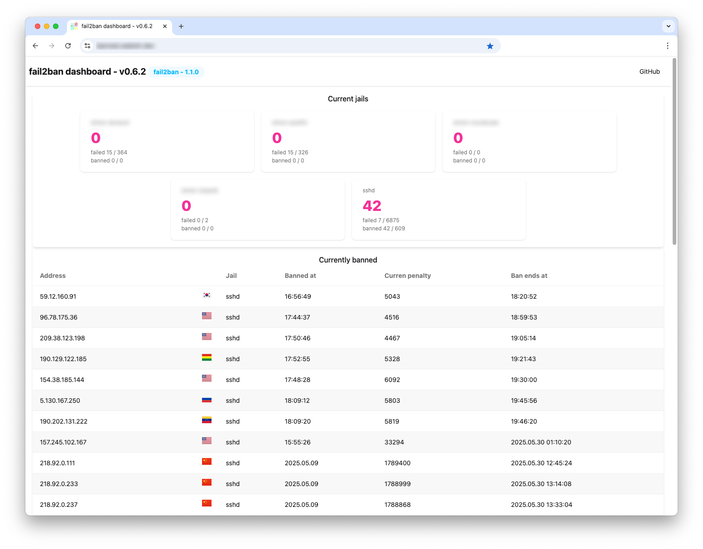

# fail2ban-dashboard


A web-based dashboard for `fail2ban` which uses the `/var/run/fail2ban/fail2ban.sock` socket to access `fail2ban`.



Tested with the following `fail2ban` versions
- `0.11.2`
- `1.0.1`
- `1.0.2`
- `1.1.0`

if the deshboard should be used with another version, please switch off the version check with the `--skip-version-check` flag.

## Build the application

To build the application, use make with the following options:

```
make

    build           - Build the application
    
    test            - Run tests
    
    clean           - Remove build artifacts
    
    help            - Show this help message
    
    all             - Run tests and build the application (default)

```


## Usage

### Command line

```
Usage:
  fail2ban-dashboard [flags]
  fail2ban-dashboard [command]

Available Commands:
  completion  Generate the autocompletion script for the specified shell
  help        Help about any command
  version     Print the version number and git hash

Flags:
  -a, --address string         address to serve the dashboard on, also F2BD_ADDRESS (default "127.0.0.1:3000")
      --auth-password string   password for basic auth, also F2BD_AUTH_PASSWORD
      --auth-user string       username for basic auth, also F2BD_AUTH_USER
  -c, --cache-dir string       directory to cache GeoIP data, also F2BD_CACHE_DIR (default current working directory)
  -h, --help                   help for fail2ban-dashboard
      --log-level string       log level (trace, debug, info, warn, error), also F2BD_LOG_LEVEL (default "info")
      --skip-version-check     skip fail2ban version check (use at your own risk), also F2BD_SKIP_VERSION_CHECK
  -s, --socket string          fail2ban socket, also F2BD_SOCKET (default "/var/run/fail2ban/fail2ban.sock")
      --trust-proxy-headers    trust proxy headers like X-Forwarded-For, also F2BD_TRUST_PROXY_HEADERS

Use "fail2ban-dashboard [command] --help" for more information about a command.

```

### Docker

With Docker use

`docker run --user=root -v /var/run/fail2ban/fail2ban.sock:/var/run/fail2ban/fail2ban.sock:ro -p 3000:3000 ghcr.io/webishdev/fail2ban-dashboard:latest`

The `root` user is necessary as by default the `fail2ban` socket is only accessible for the `root` user.

## Dashboard

When started, check http://localhost:3000/

Basic authentication can be enabled with the `--auth-user` and/or `--auth-password` flags.  
When only `--auth-user` is provided, the password will be generated and show in the logs/console.  
When only `--auth-password` is provided, the user will be named `admin`.

### Environment variables

Environment variables can be used to set parameters without using command line flags.

- `F2BD_ADDRESS`
- `F2BD_AUTH_PASSWORD`
- `F2BD_AUTH_USER`
- `F2BD_CACHE_DIR`
- `F2BD_LOG_LEVEL`
- `F2BD_SKIP_VERSION_CHECK`
- `F2BD_SOCKET`
- `F2BD_TRUST_PROXY_HEADERS`

## Inspired by

- https://github.com/fail2ban/fail2ban
- https://gitlab.com/hctrdev/fail2ban-prometheus-exporter/-/tree/main?ref_type=heads
- https://github.com/VerifiedJoseph/intruder-alert?tab=readme-ov-file
